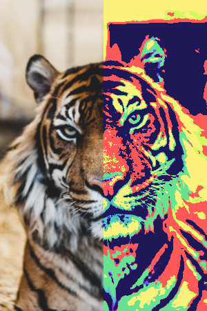

# libColorProcess

libColorProcess is a modern C++17 library for type-safe image processing. It provides types for the major relative color spaces used in image processing, as well as ways to convert between them. It is lightweight with the C++ STL being the only dependecy.

In addition to the different color vectors it also features an ImageData class, iterators for image data as well as functions to deal with color palettes.

## Including libColorProcess in your project

The easiest way to use libColorProcess is using git submodules and CMake.

Create a submodule...
```bash
git submodule add https://github.com/API-Beast/libColorProcess.git
```

... and add it to your CMakeLists.txt.
```cmake
add_subdirectory(libColorProcess)
target_link_library(YourLib libColorProcess)
```

CMake will take care of the linker options and include directories, so that now you can include libColorProcess.h to get access to all of it's functionality.
```cpp
#include <libColorProcess.h>
```

## Documentation

- [Color spaces](#color-spaces)
- [Image data](#image-data)
  * [Simple image processing](#simple-image-processing)
  * [Basic color remapping](#basic-color-remapping)
  * [Advanced color remapping](#advanced-color-remapping)
- [Color palettes](#color-palettes)

### Color spaces

The following color spaces are supported by libColorProcess.

|      Colorspace | sRGB             | HSV                    | LinearRGB        | LinearHSV              | HCY                    |
|----------------:|------------------|------------------------|------------------|------------------------|------------------------|
|      Components | red, green, blue | hue, saturation, value | red, green, blue | hue, saturation, value | hue, chroma, luminance |
| Underlying Type | float            | float                  | float            | float                  | float                  |
|       Alignment | 16 bytes         | 16 bytes               | 16 bytes         | 16 bytes               | 16 bytes               |

|      Colorspace | sRGB_uint8       | sRGB_uint8_Alpha        | sRGB_Alpha              | LinearRGB_Alpha         |
|----------------:|------------------|-------------------------|-------------------------|-------------------------|
|      Components | red, green, blue | red, green, blue, alpha | red, green, blue, alpha | red, green, blue, alpha |
| Underlying Type | uint8_t          | uint8_t                 | float                   | float                   |
|       Alignment | 4 bytes          | 4 bytes                 | 16 bytes                | 16 bytes                |

All of these share the same API, having a complete set of operator overloads, scalar constructors and vector specific member functions.

sRGB_uint8 and sRGB_uint8_Alpha are both intended as a intermediate when importing or exporting external data. For any kind of mathematical operations you should use one of the float-based color spaces to avoid overflows. LinearRGB is preferable to sRGB as blending colors in sRGB space is low quality and creates unnatural transitions. HSV should be used together with sRGB, LinearHSV together with LinearRGB.

You might notice that all of these are aligned as if they had 4 components, even though most only have 3 and could fit into 12 bytes. This is because they are optimized for performance, not storage space. This allows them to be used efficiently with SIMD instructions and it allows the compiler to automatically vectorize loops involving these structures. Automatic vectorization is enabled by default with -O2 on clang and with -O3 on GCC.

```cpp
LinearRGB color(0.5, 0.5, 0.5);
color += 0.2;             // Equivalent to color += LinearRGB(0.2, 0.2, 0.2);
color += sRGB(0.2);       // Equivalent to += colorspace_cast<LinearRGB>(sRGB(0.2, 0.2, 0.2));
color *= {1.0, 0.0, 0.0}; // Green and blue are now 0.0
color.green += 0.5;       // Directly accessing color components

float len = color.length(); // There is also square_length for performance sensitive code
color = color.normalized(); // Equivalent to color /= len;
float largest_value = color.max_value(); // Returns the highest component of the three, there is also color.min_value()

// Component-wise execution of functions.
color = color.visit(&std::abs); // Non-vector functions can be called using "visit", it will be applied to each element individually
color = color.visit(&std::max, {0.4, 0.5, 0.6}); // Equivalent to {std::max(color.red, 0.4), std::max(color.green, 0.5), std::max(color.blue, 0.6)}
// Of course you can also use lambdas with .visit

LinearRGB_Alpha with_alpha = color; // Equivalent to LinearRGB_Alpha with_alpha(color, 1.0);

HSV hsv_result = colorspace_cast<HSV>(color); // Every colorspace can be converted to every other colorspace via colorspace_cast
```

There are implicit conversions for a few specific color spaces. This is intended so you can call for example `luminance709(LinearRGB)` with a sRGB color.

| Implicit Conversions | sRGB | sRGB_uint8 | HSV | LinearRGB | LinearHSV | HCY |
|:--------------------:|:----:|:----------:|:---:|:---------:|:---------:|:---:|
|         sRGB         |   -  |      ✔     |  ✔  |     ✔     |     ❌     |  ❌  |
|      sRGB_uint8      |   ✔  |      -     |  ❌  |     ❌     |     ❌     |  ❌  |
|          HSV         |   ✔  |      ❌     |  -  |     ❌     |     ❌     |  ❌  |
|       LinearRGB      |   ✔  |      ❌     |  ❌  |     -     |     ✔     |  ✔  |
|       LinearHSV      |   ❌  |      ❌     |  ❌  |     ✔     |     -     |  ❌  |
|          HCY         |   ❌  |      ❌     |  ❌  |     ✔     |     ❌     |  -  |

### Image data

#### Simple image processing


```cpp
#include <libColorProcess.h>

int main()
{
	ImageData<sRGB_uint8> img = Image::TGA::import_from_file("source_image.tga").make_copy<sRGB_uint8>();
	// Apply to a 50x200 rectangle, with the top left corner at 170, 11 image coordinates
	for(auto& val : Iterate::rectangle(img, 170, 11, 50, 200))
		val = sRGB_uint8(255) - val;
	Image::TGA::export_to_file("invert_colors.tga", img.make_copy<sRGB_uint8_Alpha>());
}
```

#### Basic color remapping


```cpp
#include <libColorProcess.h>

int main()
{
	ImageData<LinearRGB>    img        = Image::TGA::import_from_file("source_image.tga").make_copy<LinearRGB>();
	ColorPalette<LinearRGB> target_pal = Palette::convert<LinearRGB>(Palette::GPL::import_from_file("source_palette.gpl"));

	// With Iterate::chunks we can seperate the image into mutliple, same-sized parts.
	// These are of course only iterators, the image data itself is not affected.
	auto halves = Iterate::chunks(img, std::ceil(img.size.x/2.0), img.size.y);

	// This is the first way of mapping the colors, just comparing the color vectors directly, replacing each color with the palette entry whose distance is closest.
	// This is the method used in most image manipulation programs like GIMP or Photoshop, but is naive and yields low quality results.
	// We only apply it to the second half of the image.
	for(auto& color : halves[1])
		color = Palette::map_color_absolute(target_pal, color);
	
	Image::TGA::export_to_file("basic_remap.tga", img.make_copy<sRGB_uint8_Alpha>());
}
```

#### Advanced color remapping


```cpp
#include <libColorProcess.h>

int main(int argc, const char** argv)
{
	const char* input_image = "source_image.tga";
	const char* output_image = "smart_remap.tga";
	if(argc > 2)
	{
		input_image = argv[1];
		output_image = argv[2];
	}

	ImageData<LinearRGB>    img        = Image::TGA::import_from_file(input_image).make_copy<LinearRGB>();
	ColorPalette<LinearRGB> target_pal = Palette::convert<LinearRGB>(Palette::GPL::import_from_file("source_palette.gpl"));

	// The first way we can improve this is by using different set of comparison factors from the raw color values.
	// Then we can find the minimum and maximum of each of these comparison factors,
	// this enables us to take the distance of the normalized factors rather than of the absolute factors.
	auto img_stats    = Stats::gather_stat_range(img.begin(),        img.end(),        Stats::perceptive_factors);
	auto target_stats = Stats::gather_stat_range(target_pal.begin(), target_pal.end(), Stats::perceptive_factors);
	// Further, we can give these values different weights to come closer to human perception.
	// Humans are much more sensitive to Luminance/Brightness than everything else, so we give it 3 times the weight.
	std::array<float, 5> weights = {6.0f, 1.0f, 1.0f, 1.0f, 1.0f}; 

	// With these parameters set up we can do "relative" color mapping.
	// Finally we can interpolate between multiple samples in order to get a result with smooth transitions.
	for(auto& color : img)
		color = Palette::map_color_relative_multisample(target_pal, color, Stats::perceptive_factors, target_stats, img_stats, weights);
	
	Image::TGA::export_to_file(output_image, img.make_copy<sRGB_uint8_Alpha>());
}
```

### Color palettes


```cpp
#include <libColorProcess.h>

int main()
{
	ColorPalette<sRGB_uint8> input = Palette::GPL::import_from_file("source_palette.gpl");
	ImageData<sRGB_uint8_Alpha> output;

	Vec2i array_size = {16, int(std::ceil(input.size() / 16.0))};
	Vec2i block_size = 12;

	output.allocate(array_size*block_size, {0, 0, 0, 0});
	auto chunks = Iterate::chunks(output, block_size);

	int i = 0;
	for(int y = 0; y < array_size.y; y++)
	for(int x = 0; x < array_size.x; x++)
	for(auto& color : chunks[i++])
	if(i < input.size())
		color = input[i];

	Image::TGA::export_to_file("export_palette.tga", output);
}
```